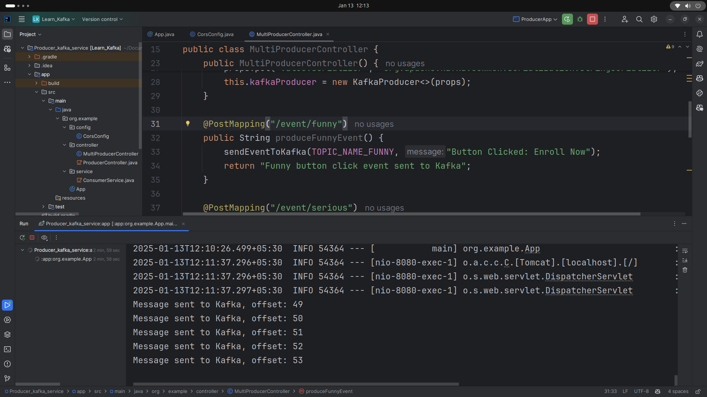
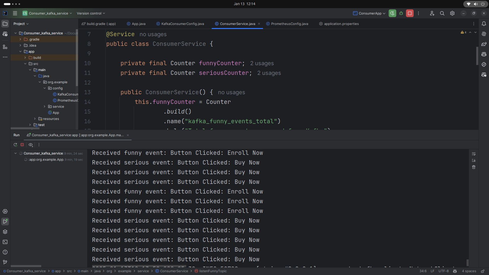
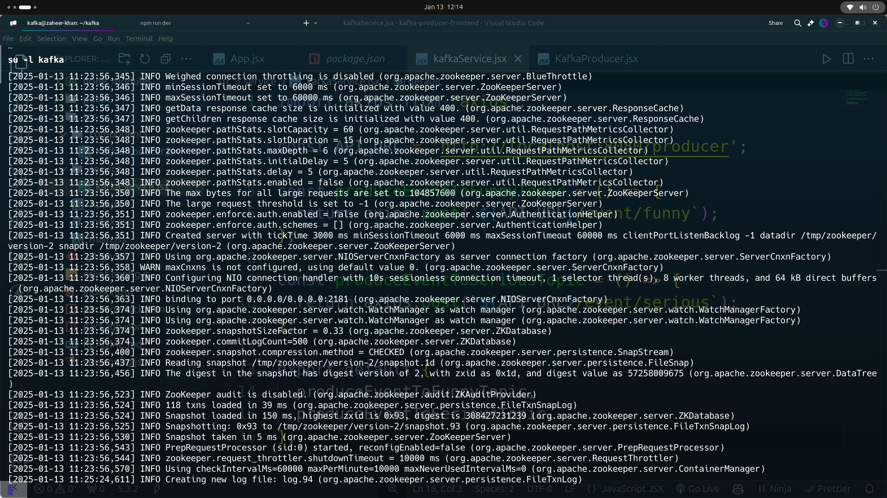
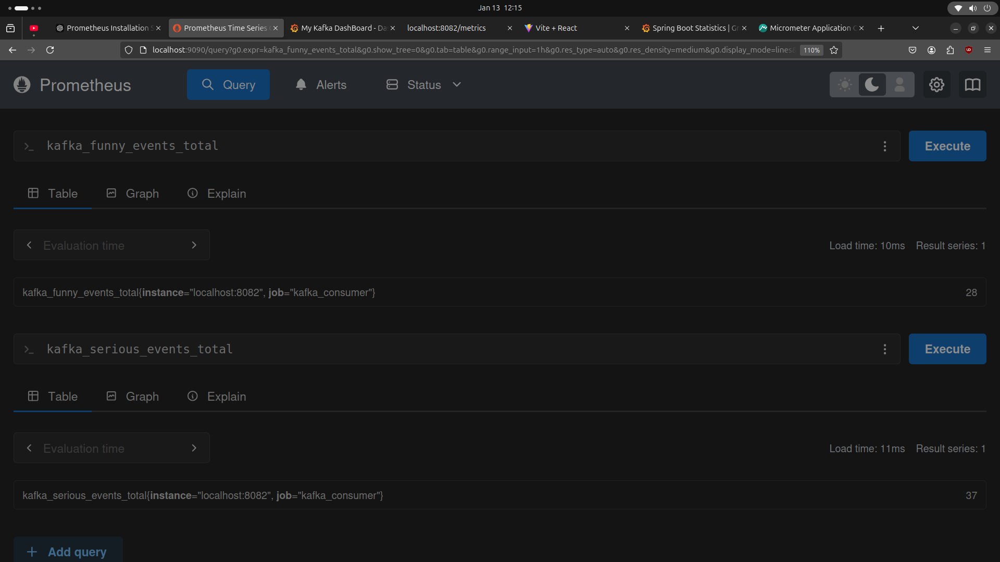
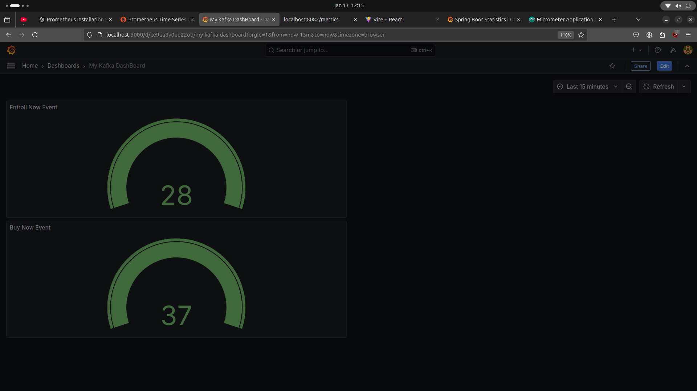

# Real-Time Monitoring System with Spring Boot, Kafka, Prometheus, and Grafana

I recently completed a project focused on creating a real-time monitoring system to track user interactions on a web application. The system leverages Spring Boot for backend services, Apache Kafka for event streaming, Prometheus for monitoring, and Grafana for visualization. Here's an overview of the workflow and key components of the project:

## Project Workflow

1. **Spring Boot Event Producer Service**:
    - Developed a Spring Boot application that captures user actions (e.g., button clicks) and produces events to a Kafka topic.
    - This service ensures real-time recording of user interactions.

2. **Spring Boot Event Consumer Service**:
    - Created a Spring Boot application that consumes events from the Kafka topic.
    - The consumer processes the events and exposes an API endpoint at `/metrics` on port `8082` for Prometheus to scrape.

3. **Prometheus Monitoring**:
    - Configured Prometheus to scrape the metrics from the consumer service every second.
    - This setup enables real-time monitoring of the processed events.

4. **Grafana Visualization**:
    - Connected Grafana to Prometheus as a data source.
    - Designed dashboards in Grafana to visualize the metrics. The dashboards display real-time data on user interactions, specifically tracking "Enroll Now" and "Buy Now" button clicks.

## Key Points

- **Event Producer Service**:
    - Captures user actions and sends events to Kafka.
    - Ensures real-time recording of interactions.

- **Event Consumer Service**:
    - Subscribes to Kafka topics and processes events.
    - Exposes metrics through an API endpoint for Prometheus.

- **Prometheus Configuration**:
    - Scrapes metrics from the consumer service every second.
    - Collects real-time data on processed events.

- **Grafana Dashboards**:
    - Visualizes metrics collected by Prometheus.
    - Provides real-time insights into user interactions, including "Enroll Now" and "Buy Now" clicks.

Grafana

